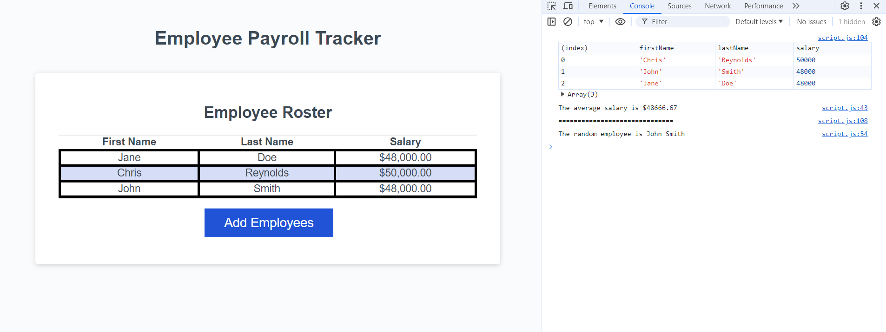

# <employee-payroll-tracker>
# 

## Description
This webpage is to provide an employer with an employee payroll tracker.  This tracker sorts employees names in alphabetical order by last name, records their salary, displays average salary in the console, displays the employee objects in the array, and also picks a random employee to display in the console.  

## Installing
N/a

## Usage
Open the webpage and click the 'Add Employees' button.  You will be met with a series of prompts collecting employee information.  Once all employee information is entered, click the cancel button.  Once the cancel button is clicked, the employees names and salary are displayed in the HTML table.  Open the console to see the objects in the array on display as well as the average salary and a random employee name.

## Screenshot 

## URL
https://chrisreynolds0508.github.io/employee-payroll-tracker/

## Authors
Chris Reynolds

## License
Please refer to the license in the repo.